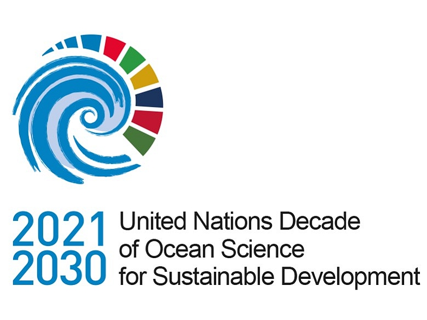
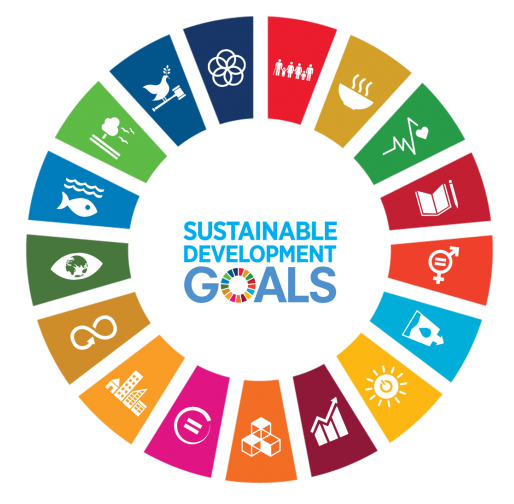

# Visualising Fish and Environment representation

A fishstats is a shiny app that provides an intuitive fisheries and environment data visualiations. The app has rich algorithms that perform analyses and allows users to interact with data and gain insight of key fisheries metrics in the marine and freshwater ecosystems. The tool is useful during this decade where the ocean and blue economy is recognized as the The Decade of the Ocean.

The Decade provides a common framework to ensure that ocean science can fully support countries’ actions to sustainably manage the ocean and more particularly to achieve the 2030 Agenda for Sustainable Development – through the creation of a new foundation, across the science-policy interface, to strengthen the management of the ocean and coasts for the benefit of humanity.

A vast majority of the ocean remains unmapped, unobserved and unexplored. Our understanding of the ocean and its contribution to sustainability largely depends on our capacity to conduct effective ocean science - through research and sustained observations, supported by adequate infrastructures and investments.

This decame of the ocean comes down with a slogan the science we want for the ocean we need! But we flip it a little bit and should read the information we want for the ocean we need, why. Because we are at the time of precedented generation of data than ever before. Data generated from sensors to satellite is enormous.

